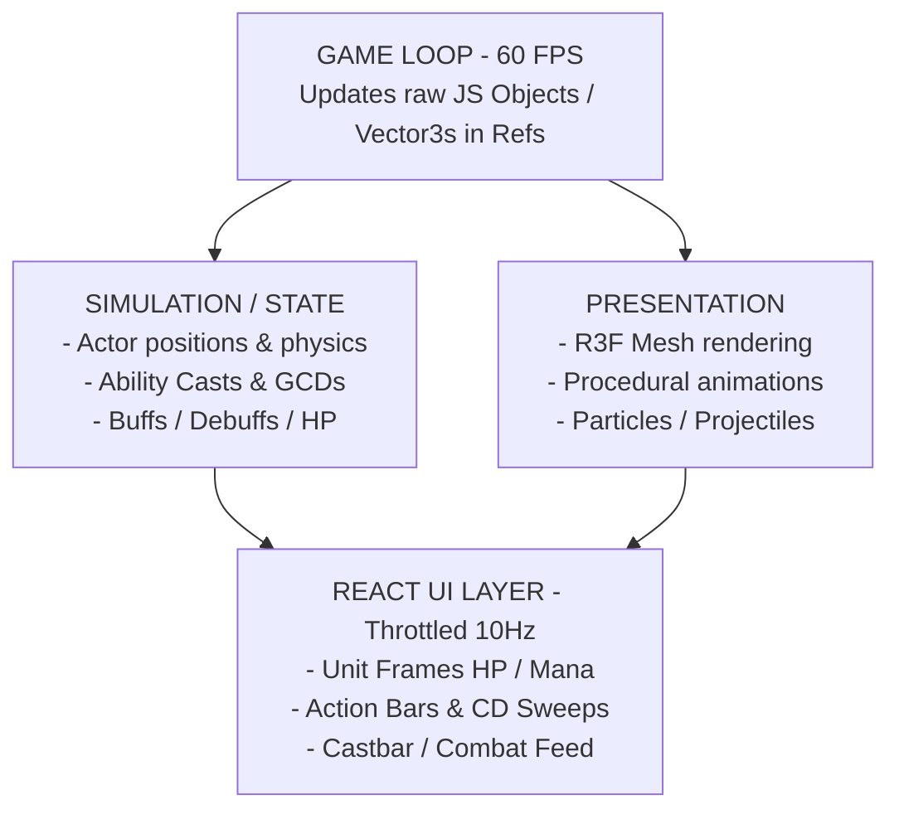

# Architecture & Design Document: 3rd-Person WoW-like 3D Battle Arena

This document details the architecture and implementation of the World of Warcraft-style 3rd-Person 3D Battle Arena inside **Mythic-Gladiators**, converting the simple 2D canvas clicker into a high-performance 3D combat simulator in React + Next.js.

---

## 1. Overview & Separation of Concerns (MVC Pattern)

In standard WoW combat, players steer their characters in 3D space, target units, and execute complex skills on a Global Cooldown (GCD) while managing resources and positioning.

To prevent React from re-rendering the 3D Canvas at high frequencies (which bottlenecked rendering at 15 FPS), we adopted a **Model-View-Controller (MVC) / Simulation-Presentation** architecture:



### Key Components

1. **The Model (Simulation - `lib/combat/`):**
   - Pure, non-React JavaScript objects running at 60 FPS.
   - Core files: `types.ts`, `actor.ts`, `ability.ts`, `projectile.ts`, `simulation.ts`.
2. **The View (3D Presentation - `components/arena-3d-canvas.tsx`):**
   - React Three Fiber (`@react-three/fiber`) and Drei (`@react-three/drei`) rendering WebGL meshes representing the gladiator ring, actors, projectiles, hazard indicators, and floating HTML text.
3. **The Controller (Interaction & UI - `components/game-arena-screen.tsx`):**
   - Standard React overlays displaying the WoW raid unit frames, player resource bars, dynamic CD sweeps, active cast bars, and a scrollable combat feed, synced via a **10Hz throttled interval** from the simulation state.

---

## 2. 3rd-Person Camera & Movement Controls

We built an exact replica of World of Warcraft's camera rig and character controls using Three.js spherical coordinate math:

- **WASD & Arrow Keys:** Moves/Strafes the player mesh relative to the camera direction.
- **Left-Click Drag:** Rotates the camera around the active player mesh (yaw and pitch) in a spherical orbit without altering the character's forward heading (free look).
- **Right-Click Drag:** Rotates the camera and steers the player mesh's forward orientation (`yaw`), locking the player's movement direction to the camera vector (character steer).
- **Scroll Wheel:** Custom zoom levels, allowing players to go from tight third-person (3m) up to wide tactical arena perspectives (32m).
- **Tab Key:** Targets the nearest hostile unit (e.g., the Evil Raid Boss) instantly.
- **Hotkeys (1 & 2):** Casts Class Ability 1 or Class Ability 2 instantly.

---

## 3. Extensible Object-Oriented Ability System

Our design allows developers to add new complex skills by simply subclassing the `Ability` base class, overriding properties, and implementing custom logic in `execute()`.

### Subclass Example: `Mage Fireball`
```typescript
export class Fireball extends Ability {
  id = "fireball";
  name = "Fireball";
  icon = "Flame";
  castTime = 2.0; // 2 seconds cast
  cooldown = 0; // Spammable
  range = 40; // 40-yard range
  cost = { resource: "mana" as const, amount: 100 };

  execute(caster: Actor, target: Actor | null, simulation: any) {
    if (!target) return;
    
    // Spawn projectile in simulation
    simulation.spawnProjectile({
      start: caster.position.clone().add({ y: 1.2 }),
      target: target,
      speed: 25,
      color: "#f97316",
      size: 0.35,
      onHit: () => {
        const isCrit = Math.random() < caster.stats.spellCrit;
        const baseDamage = 70 + Math.floor(Math.random() * 20);
        const damage = isCrit ? baseDamage * 2 : baseDamage;
        const actualDmg = target.takeDamage(damage, caster, "fire");

        simulation.log(`${caster.name}'s Fireball bursts on ${target.name} for ${actualDmg} damage!`);
        simulation.spawnFloatingText(`${actualDmg}`, target.position, "#f97316", isCrit);
      }
    });
  }
}
```

---

## 4. Finite State Machine AI for Companions and Bosses

We implemented sophisticated automated AI logic to mimic standard WoW PvE mechanics:

### Healer/Companion AI
1. Automatically targets the boss.
2. Checks all friendly party members.
3. If anyone falls below **80% health**, the healer switches targets and casts supportive healing spells (e.g. *Flash Heal*, *Healing Surge*, *Flash of Light*).
4. Otherwise, targets the boss and runs its standard damage-dealing rotation.
5. Steers towards target if outside range; stops and interrupts movement to initiate casting.

### Boss Threat & Aggro Mechanics
1. **Threat Tracking:** The boss maintains an active threat map (`threatMap`). Damage dealt by party members increases their threat. Tanks have a high-threat multiplier (e.g. **3.0x**).
2. **Dynamic Aggro:** The boss updates its target dynamically to focus the party member with the highest active threat.
3. **Melee Smashes:** Moves towards target, stopping within 6m to channel high-damage physical *Boss Smashes*.
4. **Environment Hazard Circles:** Periodically channels *Rain of Fire* (2.5s cast, 14s cooldown), spawning semi-transparent ground hazard zones centered underneath active players that tick for fire damage over time.
