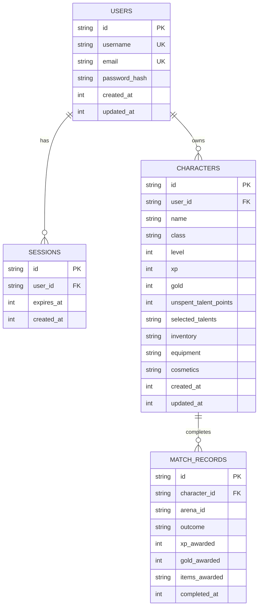
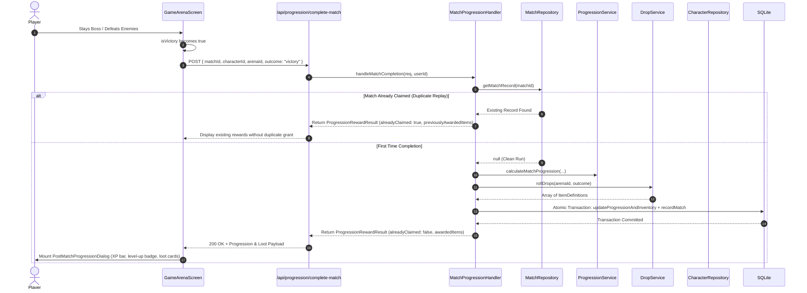

# Wiki: Persistent Character Progression, Equipment & Economy System

This document is the authoritative guide to the **Persistent Character Progression, Account Authentication, Equipment, Inventory, and Economy System** in **Mythic-Gladiators**, implemented on the `feature/items-equipment-economy` branch. All flowcharts and sequence interactions are expressed using native **Mermaid** syntax.

---

## 1. Architectural Overview & Boundary Separation

The progression, loot, and economy architecture strictly isolates the high-frequency 60 FPS combat simulation from persistence concerns. Combat simulations and React UI components do not execute SQL queries directly; all persistent data is managed through repository services and Next.js Route Handlers backed by an embedded SQLite database.

```mermaid
flowchart TD
  subgraph Client [Browser / React Client]
    CS[CombatSimulation / 3D Canvas]
    VictoryTrigger{Arena Victory Event}
    PMPUI[PostMatchProgressionDialog]
    Roster[CharacterSelectionScreen]
    InvModal[InventoryEquipmentModal]
    ShopModal[ShopModal]
    TalentsUI[SkillSelectionScreen]
  end

  subgraph API [Next.js API Layer]
    MatchEndpoint[/api/progression/complete-match]
    ShopEndpoint[/api/shop/purchase]
    EquipEndpoint[/api/characters/:id/equip]
    UnequipEndpoint[/api/characters/:id/unequip]
    AuthEndpoints[/api/auth/*]
    CharEndpoints[/api/characters/*]
  end

  subgraph Domain [Progression & Item Services]
    Handler[MatchProgressionHandler]
    Engine[ProgressionService]
    DropSvc[DropService]
    EquipSvc[EquipmentService]
    ShopSvc[ShopService]
    ItemSvc[ItemService]
  end

  subgraph Storage [Persistence Layer / SQLite]
    CharRepo[CharacterRepository]
    MatchRepo[MatchRepository]
    UserRepo[UserRepository]
    DB[(SQLite WAL Database)]
  end

  CS --> VictoryTrigger
  VictoryTrigger -->|matchId, arenaId, outcome| MatchEndpoint
  MatchEndpoint --> Handler
  Handler --> Engine
  Handler --> DropSvc
  DropSvc --> ItemSvc
  Handler --> MatchRepo
  Handler --> CharRepo
  MatchRepo --> DB
  CharRepo --> DB
  UserRepo --> DB

  MatchEndpoint -->|ProgressionRewardResult + awardedItems| PMPUI
  PMPUI -->|Spend Talent Points| TalentsUI
  PMPUI -->|Return to Roster| Roster
  Roster -->|Open Gear| InvModal
  Roster -->|Open Armory| ShopModal
  InvModal --> EquipEndpoint
  InvModal --> UnequipEndpoint
  ShopModal --> ShopEndpoint
  EquipSvc -->|applyEquipmentToActor| CS
```

---

## 2. Progression Modes: Authenticated vs. Sandbox

Mythic Gladiators supports two distinct play patterns:

| Feature | Authenticated Gladiator Mode | Instant Sandbox / Quickplay Mode |
|---|---|---|
| **Account Required** | Yes (login or registration via SQLite) | No (immediate friction-free play) |
| **Character Storage** | Saved in SQLite (`characters` table) | In-memory ephemeral gladiator |
| **XP & Gold Rewards** | Awarded based on arena completion | **None** (zero persistent XP/gold) |
| **Item Drops & Loot** | Dropped items added to persistent inventory | **None** (no persistent loot awarded) |
| **Level-Up Progression** | Permanent level increases & talent points | Ephemeral or modified via Cheats drawer |
| **Equipment & Gear** | Persistent loadouts modify combat stats | Ephemeral base stats / sandbox modifiers |
| **Post-Match Screen** | Full reward breakdown, XP progress bar, loot cards | Clearly labeled "Sandbox Trial" results screen |
| **Talent Persistence** | Saved to database and reloaded across sessions | Reset when leaving session |

---

## 3. SQLite Database Schema

The database is powered by `better-sqlite3` and is located at `data/mythic-gladiators.db`. It enforces `PRAGMA foreign_keys = ON` and operates in Write-Ahead Logging (`WAL`) mode for concurrent reads and writes.



---

## 4. Item & Equipment Domain Model

### A. Separation of Definition vs. Instance
* **`ItemDefinition`**: Static game data loaded from `lib/items/data/items.json`. Defines metadata such as name, slot, rarity, class requirements, level requirements, stat bonuses, gold prices, and 3D visual anchors.
* **`InventoryItem`**: Player-owned instance stored in character inventory as `{ instanceId: UUID, itemId: string, acquiredAt: timestamp }`. This prevents static descriptions from duplicating into the database.

### B. Equipment Slots & Stat Model
Supported slots:
* `weapon`, `head`, `chest`, `hands`, `legs`, `feet`

Combat Stats affected by equipment:
* `maxHealth`: Increases maximum and current player health.
* `armor`: Physical damage mitigation via the WoW formula $\frac{\text{Armor}}{\text{Armor} + 400}$.
* `speed`: Movement and strafing velocity.
* `spellCrit`: Critical strike chance multiplier on abilities.
* `damageMultiplier`: Percentage multiplier applied to all outgoing player damage.
* `healingMultiplier`: Percentage multiplier applied to all outgoing healing spells.

### C. Stat Resolution Formula
$$\text{Final Actor Combat Stats} = \text{Base Class Stats} + \text{Talents} + \sum_{\text{equipped}} \text{Item Stats}$$

---

## 5. Arena Loot Drops & Match Idempotency

Item rewards are rolled server-side through `DropService` and integrated directly into the atomic match-completion transaction:



### Configured Drop Tables
* **`level-1` (Evil Raid Boss)**: 85% chance of 1 roll from starter armor and weapons (e.g. *Iron Gladiator Helm*, *Rusted Gladiator Sword*, *Worn Boots*, *Reinforced Gloves*, *Acolyte Robe*).
* **`level-2` (Gladiator Skirmish 4v4)**: 100% chance of 2 rolls from advanced gear pool (e.g. *Champion's Greatsword*, *Iron Breastplate*, *Acolyte Hood*, *Initiate Staff*, *Berserker Greaves*, *Crown of the Mythic Champion*).

---

## 6. Economy & In-Game Shop Design

The in-game economy allows gladiators to spend gold earned from arena victories in the **Gladiator's Armory** (`lib/items/data/shops.json`):

* **Server-Authoritative Price Validation**: Clients submit an intent (`{ characterId, shopId, itemId }`). The server independently checks catalog pricing and verifies `character.gold >= price`.
* **Atomic Transaction**: Deducting gold and inserting the new `InventoryItem` instance happen in a single SQLite transaction, ensuring gold cannot become negative and items cannot be lost.
* **Account Verification**: Transactions require user session validation to prevent unauthorized purchases on another player's character.

---

## 7. API Route Reference

| Route | Method | Description | Auth Required |
|---|---|---|---|
| `/api/auth/register` | `POST` | Registers a new user, hashes password, sets session cookie | No |
| `/api/auth/login` | `POST` | Validates credentials, creates session, sets cookie | No |
| `/api/auth/logout` | `POST` | Revokes session token and clears auth cookie | Yes |
| `/api/auth/me` | `GET` | Returns authenticated user data or 401 | Yes |
| `/api/characters` | `GET` | Lists all gladiators owned by the authenticated player | Yes |
| `/api/characters` | `POST` | Recruits a new gladiator (Name + Class) | Yes |
| `/api/characters/:id` | `GET` | Fetches details, inventory, and equipment for a specific gladiator | Yes |
| `/api/characters/:id` | `DELETE` | Deletes a gladiator owned by the player | Yes |
| `/api/characters/:id/talents` | `PATCH` | Saves talent tree selections and unspent points | Yes |
| `/api/characters/:id/equip` | `POST` | Equips an owned inventory item into a valid equipment slot | Yes |
| `/api/characters/:id/unequip` | `POST` | Unequips an item from an equipment slot | Yes |
| `/api/shop` | `GET` | Returns available shop catalogs and item definitions | Yes |
| `/api/shop/purchase` | `POST` | Authoritatively buys an item from a shop using gold | Yes |
| `/api/progression/complete-match` | `POST` | Records match outcome, awards XP, gold, and drops atomically | Yes |

---

## 8. Automated Test Suite

Run the full progression, database, and item test suite using:

```bash
npm test
```

### Coverage Breakdown (19 Tests)
* **`lib/items/__tests__/items-and-equipment.test.ts`** (8 tests):
  * Static item definitions and field verification.
  * Drop table loot rolling on victory and zero drops on defeat.
  * Multi-roll drop behavior on higher-tier arenas.
  * Inventory persistence across database reload.
  * Slot validation, class restrictions, and level requirement enforcement.
  * Deterministic equipment stat aggregation and Actor combat modification.
  * Server-authoritative shop purchases, atomic gold deduction, and insufficient funds rejection.
  * Idempotency guarantee preventing duplicate item drops on replayed match IDs.
* **`lib/progression/__tests__/progression-service.test.ts`** (7 tests):
  * XP and gold calculation.
  * Multi-level jumps and threshold crossing.
  * Maximum level cap clamping.
  * Talent point awards matching levels gained.
  * XP progress bar percentages.
* **`lib/db/__tests__/persistence.test.ts`** (4 tests):
  * User authentication with salted `scrypt` hashing.
  * Character save/load persistence.
  * Talent allocation persistence.
  * Match record idempotency for XP and gold.
