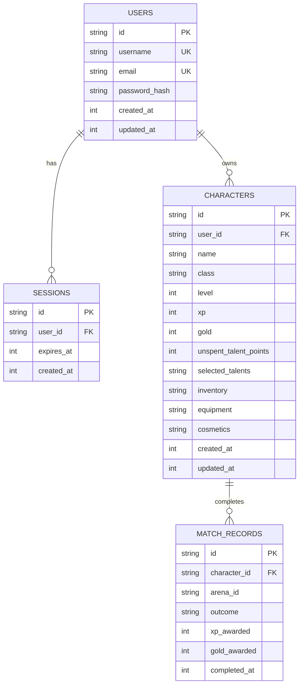
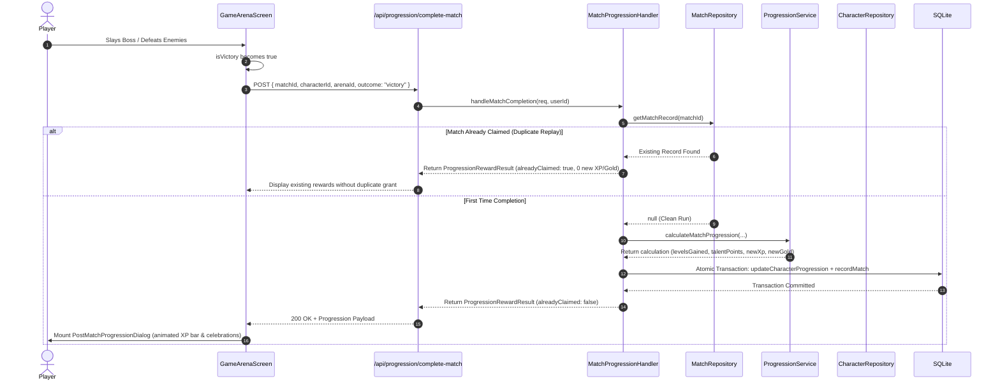

# Wiki: Persistent Character Progression & Economy System

This document is the authoritative guide to the **Persistent Character Progression, Account Authentication, and Progression Rewards System** in **Mythic-Gladiators**, implemented on the `feature/character-progression` branch. All flowcharts and sequence interactions are expressed using native **Mermaid** syntax.

---

## 1. Architectural Overview & Boundary Separation

The progression system strictly isolates the high-frequency combat simulation from persistence concerns. Combat simulations and React UI components do not execute SQL queries directly; all persistent data is managed through repository services and Next.js Route Handlers backed by an embedded SQLite database.

```mermaid
flowchart TD
  subgraph Client [Browser / React Client]
    CS[CombatSimulation / 3D Canvas]
    VictoryTrigger{Arena Victory Event}
    PMPUI[PostMatchProgressionDialog]
    Roster[CharacterSelectionScreen]
    TalentsUI[SkillSelectionScreen]
  end

  subgraph API [Next.js API Layer]
    MatchEndpoint[/api/progression/complete-match]
    AuthEndpoints[/api/auth/*]
    CharEndpoints[/api/characters/*]
  end

  subgraph Domain [Progression Domain Service]
    Handler[MatchProgressionHandler]
    Engine[ProgressionService]
    Config[Progression & Arena Config]
  end

  subgraph Storage [Persistence Layer / SQLite]
    CharRepo[CharacterRepository]
    MatchRepo[MatchRepository]
    UserRepo[UserRepository]
    DB[(SQLite WAL Database)]
  end

  CS --> VictoryTrigger
  VictoryTrigger -->|matchId, arenaId, outcome| MatchEndpoint
  MatchEndpoint --> Handler
  Handler --> Engine
  Engine --> Config
  Handler --> MatchRepo
  Handler --> CharRepo
  MatchRepo --> DB
  CharRepo --> DB
  UserRepo --> DB

  MatchEndpoint -->|ProgressionRewardResult| PMPUI
  PMPUI -->|Spend Talent Points| TalentsUI
  PMPUI -->|Return to Roster| Roster
  TalentsUI -->|PATCH /api/characters/:id/talents| CharEndpoints
```

---

## 2. Progression Modes: Authenticated vs. Sandbox

Mythic Gladiators supports two distinct play patterns:

| Feature | Authenticated Gladiator Mode | Instant Sandbox / Quickplay Mode |
|---|---|---|
| **Account Required** | Yes (login or registration via SQLite) | No (immediate friction-free play) |
| **Character Storage** | Saved in SQLite (`characters` table) | In-memory ephemeral gladiator |
| **XP & Gold Rewards** | Awarded based on arena completion | **None** (zero persistent XP/gold) |
| **Level-Up Progression** | Permanent level increases & talent points | Ephemeral or modified via Cheats drawer |
| **Post-Match Screen** | Full reward breakdown, XP progress bar, level-up celebration | Clearly labeled "Sandbox Trial" results screen |
| **Talent Persistence** | Saved to database and reloaded across sessions | Reset when leaving session |

---

## 3. SQLite Database Schema

The database is powered by `better-sqlite3` and is located at `data/mythic-gladiators.db`. It enforces `PRAGMA foreign_keys = ON` and operates in Write-Ahead Logging (`WAL`) mode for concurrent reads and writes.



### Table Definitions

1. **`users`**: Manages player accounts with cryptographically salted passwords hashed via Node's native `crypto.scryptSync`.
2. **`sessions`**: Server-side authentication tokens linked via HTTP-only cookie (`mg_session`).
3. **`characters`**: Core gladiator entities. Stores level, XP, gold, unspent talent points, and JSON arrays/objects for talents, future inventory, equipment slots, and cosmetics.
4. **`match_records`**: Audit trail of completed arena runs. Stores the unique `matchId` per game session to enforce **idempotency** and prevent duplicate reward claims.

---

## 4. Progression Formulas & Level Curve

Progression values are defined centrally in `lib/progression/config.ts`:

### Arena Rewards Table
* **`level-1` (Evil Raid Boss)**: `120 XP` | `50 Gold`
* **`level-2` (Gladiator Skirmish 4v4)**: `250 XP` | `120 Gold`

### Leveling Curve & Caps
* **Initial Level**: `1`
* **Maximum Level Cap**: `10`
* **Talent Points Per Level**: `1 point` awarded per level gained.
* **XP Thresholds** (XP required to advance from Level $N$ to Level $N + 1$):
  * Level 1 $\rightarrow$ 2: `100 XP`
  * Level 2 $\rightarrow$ 3: `150 XP`
  * Level 3 $\rightarrow$ 4: `220 XP`
  * Level 4 $\rightarrow$ 5: `310 XP`
  * Level 5 $\rightarrow$ 6: `420 XP`
  * Level 6 $\rightarrow$ 7: `550 XP`
  * Level 7 $\rightarrow$ 8: `700 XP`
  * Level 8 $\rightarrow$ 9: `880 XP`
  * Level 9 $\rightarrow$ 10: `1100 XP`
  * Level 10 (Max Level Cap): Clamped; excess XP is retained.

### Multi-Level Jump Calculation
When a large XP reward is granted, `ProgressionService.calculateXpAddition()` iterates across thresholds:
$$\text{while (XP} \ge \text{XP}_{\text{required}} \text{ and Level} < \text{Level}_{\text{max}}\text{): Level} \mathrel{+}= 1, \quad \text{XP} \mathrel{-}= \text{XP}_{\text{required}}, \quad \text{Talents} \mathrel{+}= 1$$

---

## 5. Match Completion & Idempotency Sequence



---

## 6. API Route Reference

| Route | Method | Description | Auth Required |
|---|---|---|---|
| `/api/auth/register` | `POST` | Registers a new user, hashes password, sets session cookie | No |
| `/api/auth/login` | `POST` | Validates credentials, creates session, sets cookie | No |
| `/api/auth/logout` | `POST` | Revokes session token and clears auth cookie | Yes |
| `/api/auth/me` | `GET` | Returns authenticated user data or 401 | Yes |
| `/api/characters` | `GET` | Lists all gladiators owned by the authenticated player | Yes |
| `/api/characters` | `POST` | Recruits a new gladiator (Name + Class) | Yes |
| `/api/characters/:id` | `GET` | Fetches details for a specific gladiator | Yes |
| `/api/characters/:id` | `DELETE` | Deletes a gladiator owned by the player | Yes |
| `/api/characters/:id/talents` | `PATCH` | Saves talent tree selections and unspent points | Yes |
| `/api/progression/complete-match` | `POST` | Records match outcome, calculates and persists rewards | Yes |

---

## 7. Automated Test Suite

Run the full progression and database test suite using:

```bash
npm test
```

### Coverage Breakdown
* **`lib/progression/__tests__/progression-service.test.ts`** (7 unit tests):
  * Normal XP and gold rewards on victory.
  * Zero rewards on defeat.
  * Partial progress without leveling up.
  * Multi-level jumps from large rewards.
  * Clamping at maximum level cap.
  * Zero talent points awarded once at cap.
  * Accurate XP percentage calculations for UI progress bars.
* **`lib/db/__tests__/persistence.test.ts`** (4 integration tests):
  * User account creation, `scrypt` hashing, and case-insensitive login.
  * Gladiator character creation, load, and progression updates across reloads.
  * Talent tree allocation and unspent talent points persistence.
  * Idempotency enforcement verifying that identical `matchId` submissions never grant duplicate rewards.
