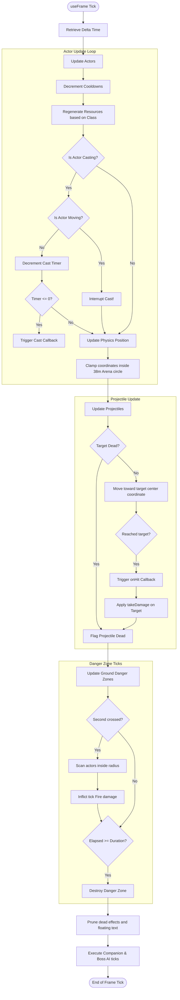
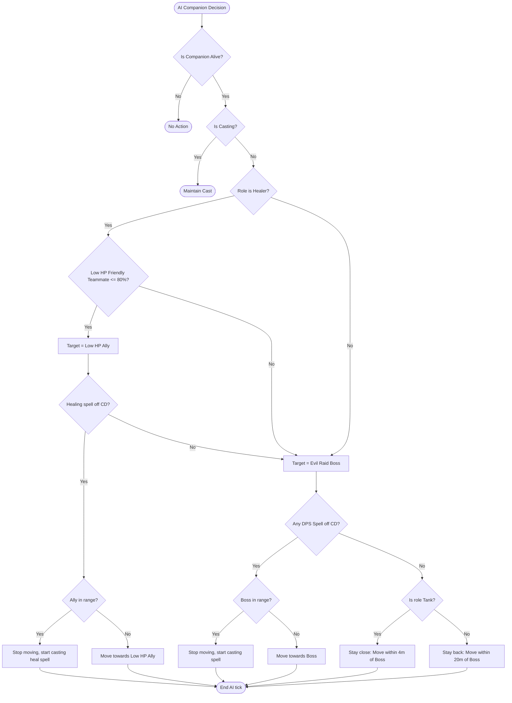
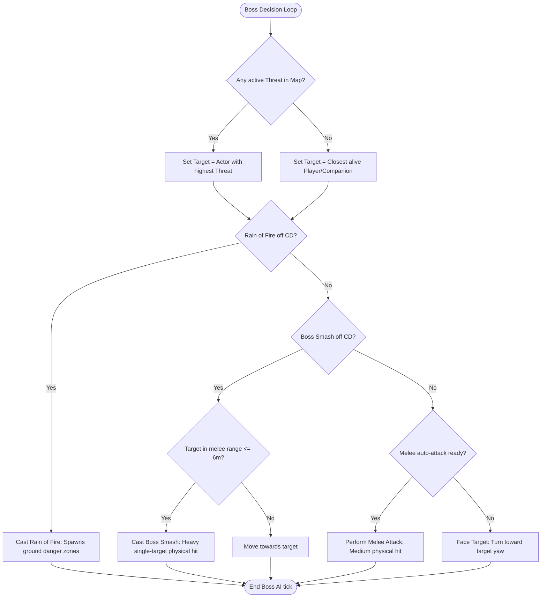
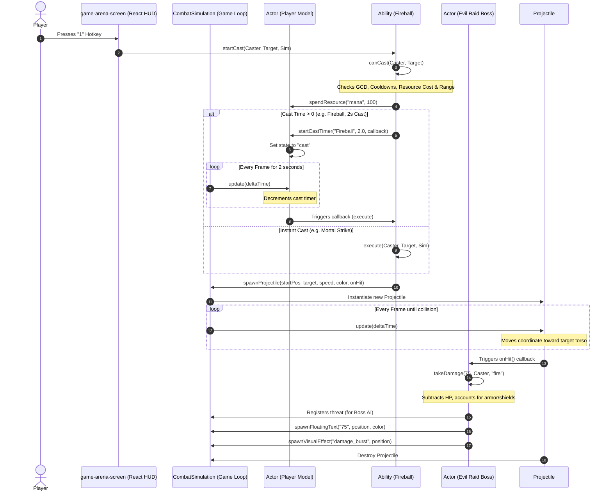
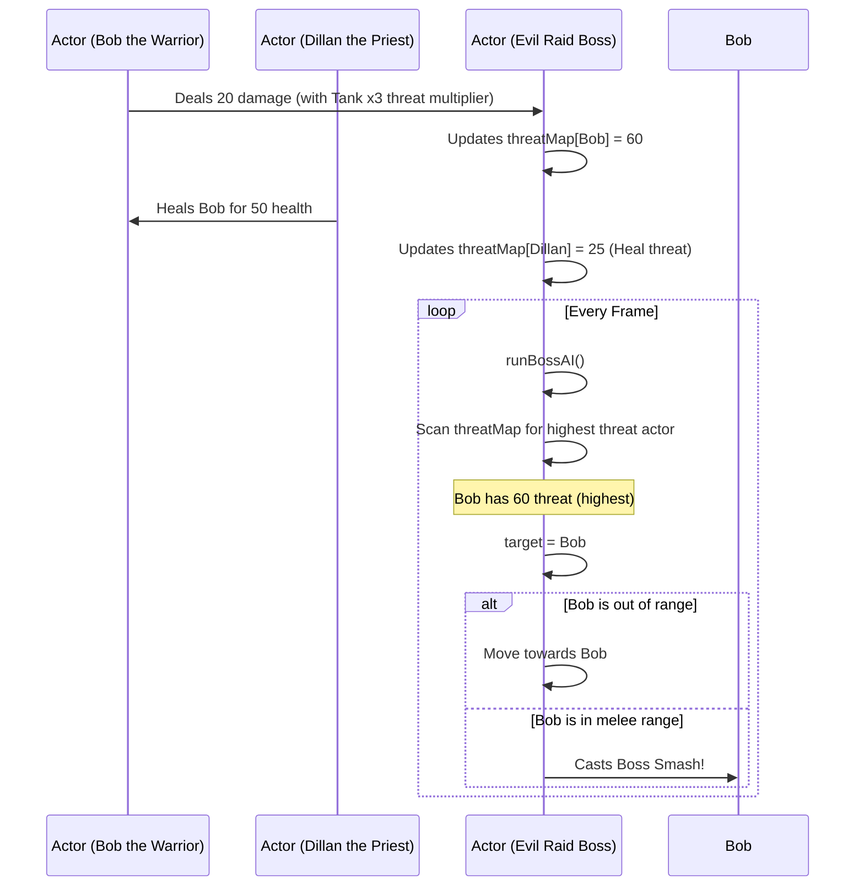
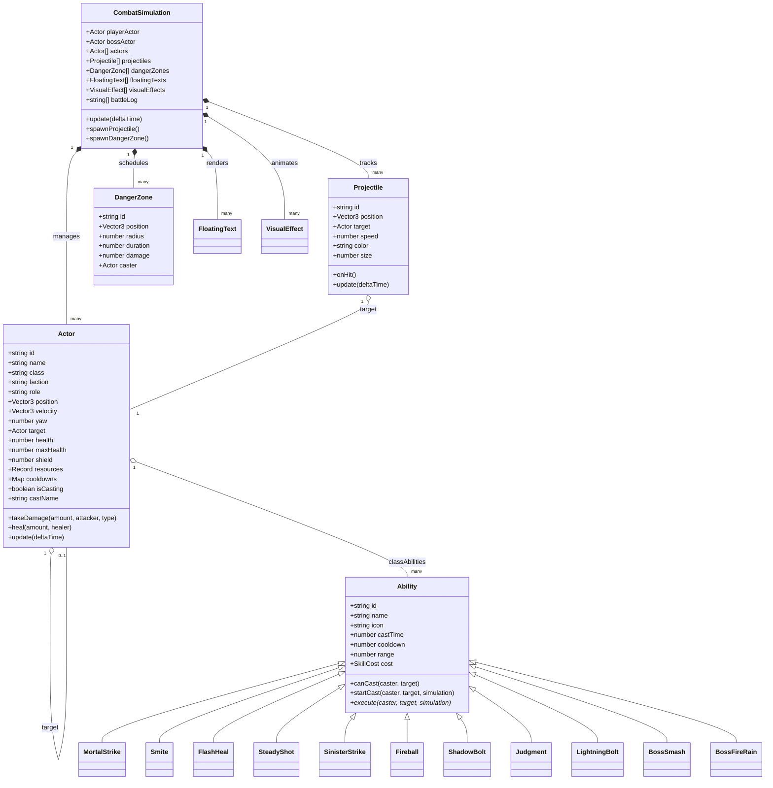

# Wiki: Combat Component Blueprint (Master Reference)

This document is the unified, authoritative guide outlining the complete architectural flow, logic decisions, and object-oriented memory snapshots of the **3rd-Person WoW-like Combat System** in **Mythic-Gladiators**. All diagrams are built natively using **Mermaid** syntax.

---

## 1. Flowcharts (Behavioral Logic)

The following flowcharts map the execution of high-frequency physics/state loops and the Finite State Machine (FSM) structures of the gladiator actors.

### A. High-Frequency Game Loop & Update Flow

This chart captures the frame tick inside React Three Fiber (`useFrame`). The loop runs at 60 FPS in WebGL and is completely decoupled from slow React rendering.



---

### B. Companion AI FSM Logic Flow

This flowchart describes the automated decision-making of the player's AI companions (Bob, Jessica, Dillan, Sarah) during active combat.



---

### C. Enemy Boss AI Decision Flow

This chart shows how the Evil Raid Boss resolves target priorities via threat, executing heavy physical strikes or casting environmental hazard circles dynamically.



---

## 2. Sequence Diagrams (Chronological Interactions)

These diagrams describe the sequence of events across multiple objects over time during core combat scenarios.

### A. Casting a Spell Chronology (Mage Fireball)



---

### B. Threat & Target Aggro Resolution



---

## 3. Object Diagrams (Structural Relationships)

These diagrams visualize the structural definitions and Heap relationships of entities in memory.

### A. Class Relationship Map



---

### B. Memory Heap State Map

```mermaid
classDiagram
  class CombatSimulation_Heap {
    playerActor: ref Player
    bossActor: ref Boss
    actors: [ref Player, ref Boss, ref Bob, ref Dillan]
    projectiles: [ref Proj_Fireball]
  }

  class Player_Actor {
    id: "user"
    target: ref Boss
    health: 200
  }

  class Boss_Actor {
    id: "boss"
    target: ref Player
    health: 1350
    threatMap: { "user": 120, "bob": 340 }
  }

  class Fireball_Projectile {
    id: "proj_f1"
    position: Vector3(10, 1, -2)
    target: ref Boss
    onHit: ref Callback
  }

  CombatSimulation_Heap --> Player_Actor : playerActor
  CombatSimulation_Heap --> Boss_Actor : bossActor
  Player_Actor --> Boss_Actor : target
  Boss_Actor --> Player_Actor : target
  CombatSimulation_Heap --> Fireball_Projectile : projectiles[0]
  Fireball_Projectile --> Boss_Actor : target
```
